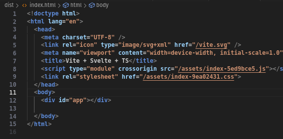
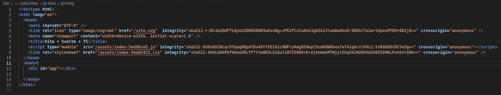

# Subresource Integrity (SRI)

<p style="text-align: center;">
    <a href="https://jsr.io/@jadsn/vite-plugin-sri">
        
    </a>
    <a href="https://jsr.io/@jadsn/vite-plugin-sri">
        
    </a>
<p>

Adds subresource integrity hashes to script and stylesheet imports from at index.html file at build time.

## Before



## After



## Usage

Install wasmtime: `curl https://wasmtime.dev/install.sh -sSf | bash` and download the `sri.wasm` compiled executing the code below:

```bash
rm -rfv sriwasm/
git clone https://github.com/JADSN1894/sriwasm
cp -v ./sriwasm/sri.wasm ./
rm -rfv sriwasm/
npm run build # Your build script
```

## Ohh!! Is not a Vite(or another bundler) then...

**Execute:** `wasmtime --dir=/ --dir=. <filename>.wasm <hash algorithm> <airtifact_folder>`

**Example:** `wasmtime --dir=/ --dir=. ./sri.wasm Sha512 ./dist`

## Disclaimer

Given the instability of the WASI API, utilizing *Wasmtime* ensures reliable execution of the compiled *sri.wasm* file. 

Look for the issues: [**WASI support #441**](https://github.com/jsr-io/jsr/issues/441#issue-2261269578) and [**node:wasi fails during module resolution #23531**](https://github.com/denoland/deno/issues/23531#issue-2261358686) 

## Links

1. [**WebAssembly System Interface (WASI)#**](https://nodejs.org/api/wasi.html)
1. [**WASI tutorial**](https://github.com/bytecodealliance/wasmtime/blob/main/docs/WASI-tutorial.md)
1. [**How to convert hexadecimal values to Base64 in Rust**](https://stackoverflow.com/questions/26185485/how-to-convert-hexadecimal-values-to-base64-in-rust)
1. [**Deno wasi**](https://deno.land/std@0.206.0/wasi/snapshot_preview1.ts)
1. [**Synchronizy your type definitions between Rust and other languages for seamless FFI**](https://github.com/1Password/typeshare)
1. [**How works sha256**](https://sha256algorithm.com/)
1. [**Leveraging Rust to Bundle Node Native Modules and Wasm into an Isomorphic NPM Package**](https://nickb.dev/blog/leveraging-rust-to-bundle-node-native-modules-and-wasm-into-an-isomorphic-npm-package/)
1. [**WebAssembly System Interface (WASI)**](https://github.com/nodejs/node/blob/main/doc/api/wasi.md)
1. [**Getting started with NodeJS and the WebAssembly System Interface**](https://radu-matei.com/blog/nodejs-wasi/)